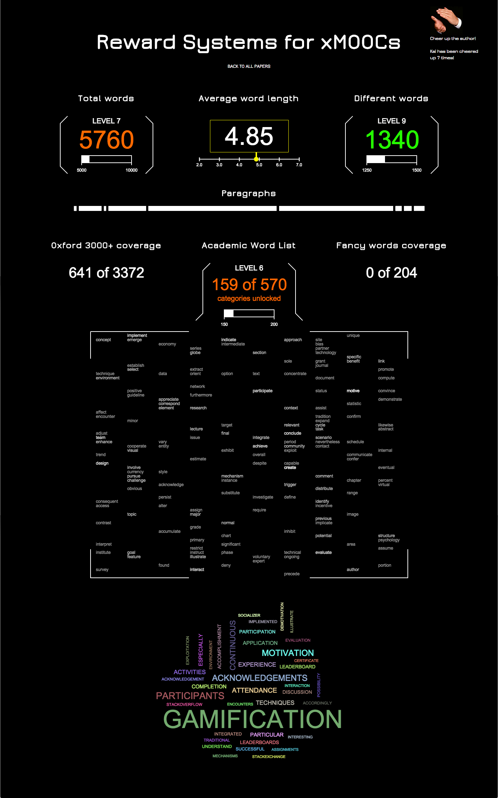

paper-gamification-website
==================

Gamifiy your paper writing experiences!

This is a visualization website of the statistics generated by the python script in my other repository: [paper-gamification](https://github.com/Kadrian/paper-gamification). The main part of the visualization is done with the help of HTML `<canvas>` and several [Processing.js](http://processingjs.org/) scripts.

## Installation

**1) Deployment**

Change credentials in `author.yml

At the moment, I use Heroku for deployment, but you should be able to deploy this app anywhere. For Heroku: clone this repository, register on [Heroku](https://www.heroku.com/) and follow their instructions on how to deploy a rails app.

**2) Setup**

* Create and migrate the database
* Insert at least one paper. For example via rails console on Heroku: 

`heroku run rails console`

`Paper.create :title => "The Flux-Compensator"`

* Use that so-created paper ID when starting the [paper-gamification](https://github.com/Kadrian/paper-gamification) python script.

[OPTIONAL] If you want to receive emails when someone cheers you up:

* [OPTIONAL] Add Postmark for sending emails on Heroku
`heroku addons:docs postmark`

* [OPTIONAL] Configure Postmark to use your email settings
`heroku addons:open postmark`

* [OPTIONAL] If you want to use postmark locally as well: you have to set environment variables.
To do this automatically, you can use foreman. Create a file with your settings:
`
bash -c 'echo "POSTMARK_API_KEY=`heroku config:get POSTMARK_API_KEY`" >> .env'
bash -c 'echo "POSTMARK_SMTP_SERVER=`heroku config:get POSTMARK_SMTP_SERVER`" >> .env'
bash -c 'echo "POSTMARK_INBOUND_ADDRESS=`heroku config:get POSTMARK_INBOUND_ADDRESS`" >> .env'
`and start your rails instance with `foreman start`

## Contribution

Plese feel free to contribute! I'm rather new to open source publishing ;)
